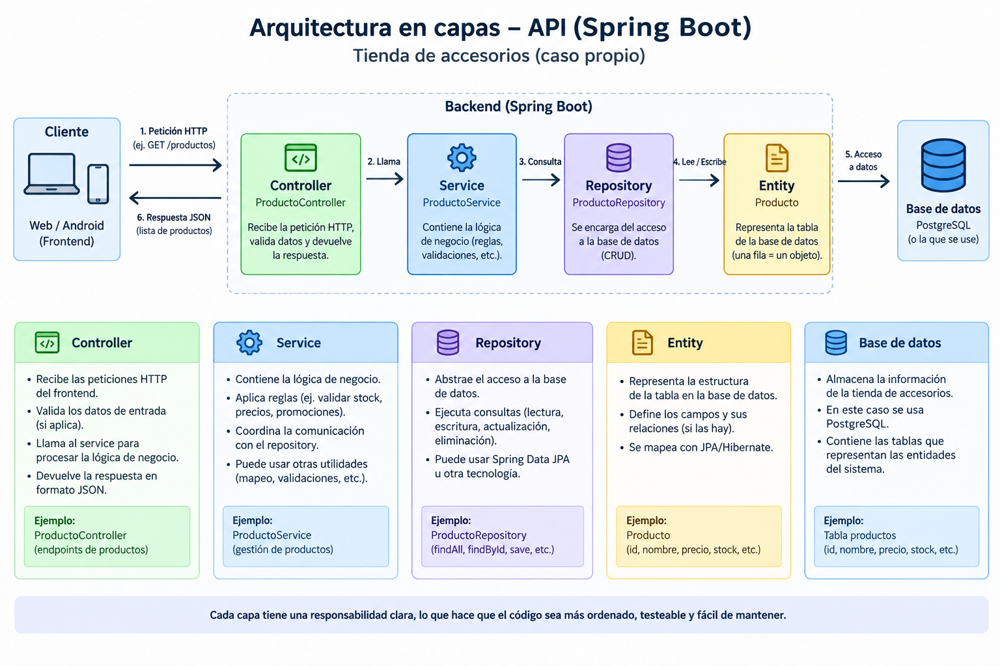

# Arquitectura en capas de una API REST con Spring Boot

## Caso de estudio: Tienda virtual de accesorios

Para esta actividad se plantea la arquitectura en capas de una API REST desarrollada con **Spring Boot**, tomando como caso de estudio una tienda virtual de accesorios para mujeres.

La API permitirá gestionar información relacionada con los productos de la tienda, como anillos, collares y otros accesorios.

El objetivo de utilizar una arquitectura en capas es separar las responsabilidades del sistema para que el código sea más organizado, fácil de entender, probar y mantener.

## Diagrama de arquitectura



## Flujo de una petición

Cuando un usuario consulta los productos desde la aplicación web o móvil, la petición sigue un flujo entre las diferentes capas:

**Cliente → Controller → Service → Repository → Entity → Base de datos**

Por ejemplo, si el cliente realiza una petición:

```text
GET /api/products
```

el flujo sería:

1. El **Controller** recibe la petición HTTP.
2. El **Service** procesa la solicitud y aplica las reglas de negocio necesarias.
3. El **Repository** realiza la consulta correspondiente a la base de datos.
4. La **Entity** representa la información del producto dentro de la aplicación.
5. La base de datos devuelve la información solicitada.
6. La respuesta regresa por las diferentes capas hasta llegar al cliente en formato JSON.

---

## 1. Controller

El **Controller** es la capa encargada de recibir las peticiones HTTP que realiza el cliente y devolver las respuestas correspondientes.

En el caso de la tienda de accesorios, podríamos tener una clase llamada:

```text
ProductoController
```

Esta clase tendría endpoints relacionados con los productos, por ejemplo:

```text
GET    /api/products
GET    /api/products/{id}
POST   /api/products
PUT    /api/products/{id}
DELETE /api/products/{id}
```

El Controller no debería contener toda la lógica del sistema ni acceder directamente a la base de datos. Su función principal es recibir la petición, validar los datos necesarios, comunicarse con el Service y devolver la respuesta.

### Ejemplo

Un cliente solicita la lista de productos:

```text
GET /api/products
```

El `ProductoController` recibe esta petición y solicita al `ProductoService` que obtenga los productos.

---

## 2. Service

El **Service** contiene la lógica de negocio de la aplicación.

Para este caso podríamos tener:

```text
ProductoService
```

Esta capa recibe las solicitudes del Controller y decide qué operaciones deben realizarse.

Por ejemplo, al crear o actualizar un producto, el Service podría validar reglas como:

* El producto debe tener un nombre.
* El precio debe ser mayor que cero.
* El stock no puede ser negativo.
* El producto debe pertenecer a una categoría válida.
* Se pueden aplicar reglas relacionadas con promociones o disponibilidad.

El Service también se encarga de comunicarse con el Repository para obtener o guardar la información.

La principal ventaja es que las reglas de negocio no quedan mezcladas dentro del Controller.

---

## 3. Repository

El **Repository** es la capa encargada de realizar el acceso a los datos.

Para el caso de estudio podríamos tener:

```text
ProductoRepository
```

Esta capa permite realizar operaciones sobre los productos almacenados en la base de datos.

Entre las operaciones más comunes se encuentran:

```text
findAll()
findById()
save()
delete()
```

Por ejemplo, cuando el usuario solicita todos los productos, el Service puede pedirle al `ProductoRepository` que consulte los registros correspondientes.

De esta manera, el Controller no necesita comunicarse directamente con la base de datos.

---

## 4. Entity

La **Entity** representa dentro de la aplicación la estructura de una entidad almacenada en la base de datos.

Para este caso se tendría una entidad:

```text
Producto
```

Esta entidad podría contener información como:

```text
id
codigo
nombre
descripcion
precio
stock
categoria
material
```

Por ejemplo, un producto podría representarse conceptualmente de la siguiente manera:

```text
Producto
├── id
├── codigo
├── nombre
├── descripcion
├── precio
├── stock
├── categoria
└── material
```

Con Spring Boot y JPA/Hibernate, la Entity puede ser relacionada con una tabla de la base de datos.

---

## 5. Base de datos

La **base de datos** es donde se almacena de forma persistente la información del sistema.

Para este proyecto se puede utilizar **PostgreSQL**.

En ella se almacenarían los productos y las demás entidades necesarias para el funcionamiento de la tienda.

Por ejemplo, una tabla de productos podría contener información como:

```text
productos
-----------------------------------------
id | codigo | nombre | precio | stock
-----------------------------------------
1  | A001   | Anillo | 35000  | 10
2  | C002   | Collar | 55000  | 5
```

El acceso a estos datos se realiza a través del Repository, manteniendo separadas las responsabilidades de cada capa.

---

## Relación entre las capas

Las capas trabajan de manera organizada siguiendo un flujo:

```text
┌─────────────────────┐
│      Cliente        │
│   Web / Android     │
└──────────┬──────────┘
           │
           │ Petición HTTP
           ▼
┌─────────────────────┐
│      Controller     │
│ ProductoController  │
└──────────┬──────────┘
           │
           ▼
┌─────────────────────┐
│       Service       │
│   ProductoService   │
└──────────┬──────────┘
           │
           ▼
┌─────────────────────┐
│      Repository     │
│ ProductoRepository  │
└──────────┬──────────┘
           │
           ▼
┌─────────────────────┐
│       Entity        │
│      Producto       │
└──────────┬──────────┘
           │
           ▼
┌─────────────────────┐
│    Base de datos    │
│     PostgreSQL      │
└─────────────────────┘
```

La respuesta realiza el recorrido de regreso hasta llegar al cliente.

## Regla principal de la arquitectura

Una regla importante de esta arquitectura es que el **Controller no debe acceder directamente al Repository**.

El flujo recomendado es:

```text
Controller → Service → Repository
```

Esto permite que cada capa tenga una responsabilidad específica.

Por ejemplo, si en el futuro se modifica la forma en que se almacenan los productos, no sería necesario modificar toda la lógica del Controller, ya que el acceso a los datos está separado en el Repository.

## Ventajas de utilizar arquitectura en capas

La arquitectura en capas permite:

* Mantener el código organizado.
* Separar las responsabilidades.
* Facilitar las pruebas de cada componente.
* Evitar que toda la lógica se concentre en una sola clase.
* Facilitar el mantenimiento del proyecto.
* Permitir realizar cambios en una capa sin afectar directamente a las demás.
* Hacer que el proyecto sea más fácil de comprender y ampliar.

## Conclusión

La arquitectura en capas permite organizar una API REST desarrollada con Spring Boot de acuerdo con la responsabilidad de cada componente.

En el caso de la tienda virtual, el **Controller** recibe las peticiones de los clientes, el **Service** maneja las reglas de negocio, el **Repository** se encarga del acceso a los datos y la **Entity** representa la información que se almacena en la base de datos.

De esta manera, cada capa cumple una función específica y el sistema puede crecer de una forma más ordenada, mantenible y fácil de probar.
