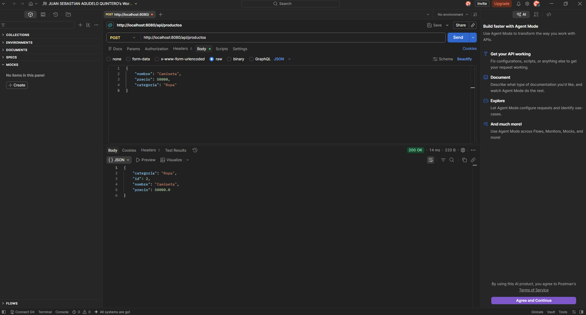
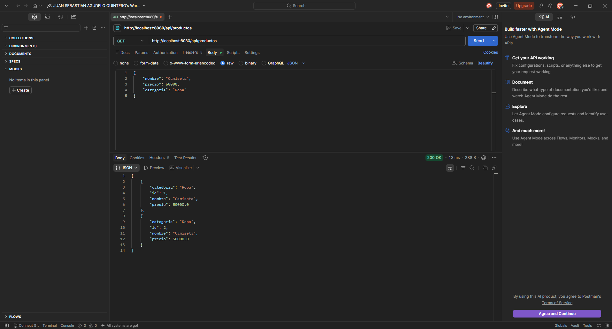
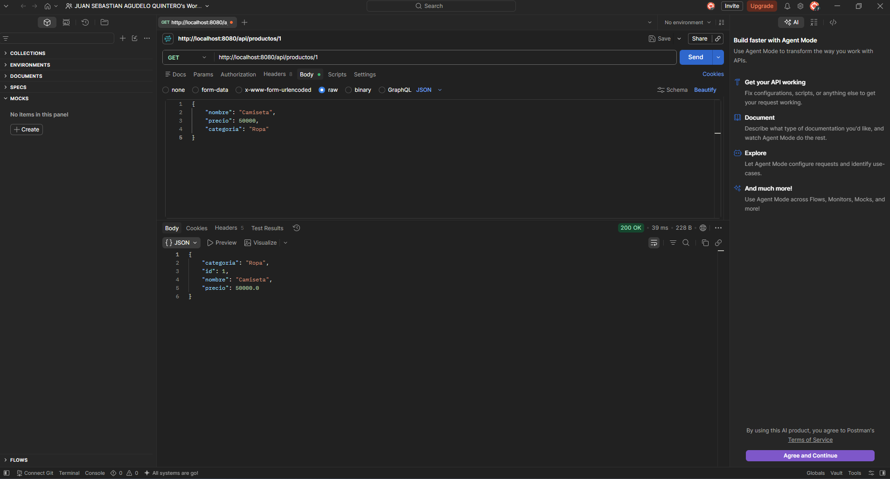
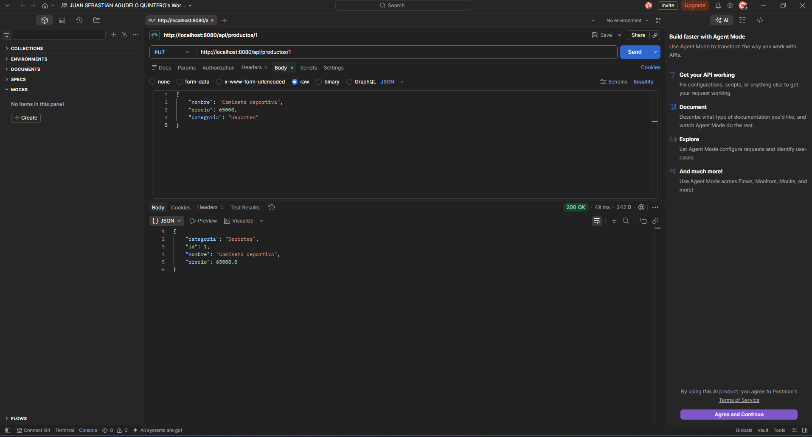
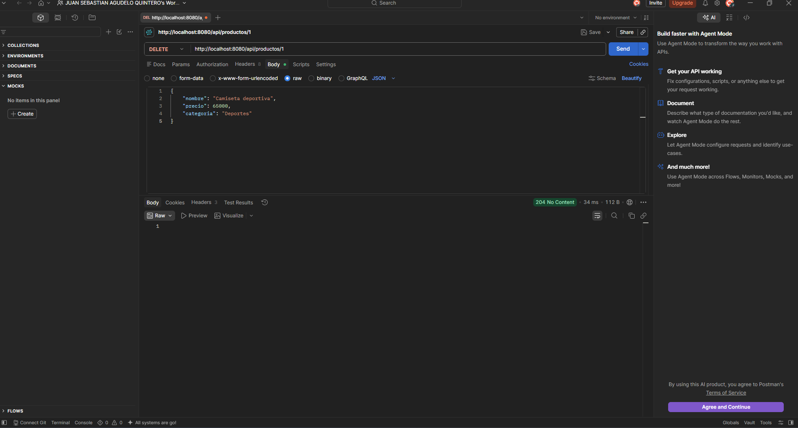

# Actividad Semana — Capa de Datos con JPA

## Descripción

En esta actividad se implementó una capa de datos utilizando **Java, Spring Boot, Spring Data JPA y H2**.

El objetivo es comprender cómo una clase Java puede representar una tabla de una base de datos mediante JPA y cómo un `Repository` permite realizar operaciones CRUD sin necesidad de escribir directamente las consultas SQL.

## Caso seleccionado

El caso seleccionado es un sistema sencillo para la **gestión de productos**.

Cada producto tiene los siguientes datos:

* `id`: identificador único del producto.
* `nombre`: nombre del producto.
* `precio`: precio del producto.
* `categoria`: categoría a la que pertenece.

## Mapeo objeto-relacional (ORM)

Se utilizó JPA para realizar el mapeo entre la clase `Producto` y la tabla `PRODUCTO` de la base de datos.

La clase Java:

```java
@Entity
public class Producto {
    ...
}
```

representa una tabla en la base de datos.

El atributo:

```java
@Id
@GeneratedValue(strategy = GenerationType.IDENTITY)
private Long id;
```

representa la clave primaria y permite que el identificador sea generado automáticamente.

El mapeo se puede representar de la siguiente manera:

```text
Clase Java                 Base de datos

Producto        ────────→  PRODUCTO
id              ────────→  ID
nombre          ────────→  NOMBRE
precio          ────────→  PRECIO
categoria       ────────→  CATEGORIA
```

De esta manera, Hibernate puede crear y administrar la tabla a partir de la entidad Java.

## Entity

La entidad utilizada es `Producto`.

```java
@Entity
public class Producto {

    @Id
    @GeneratedValue(strategy = GenerationType.IDENTITY)
    private Long id;

    private String nombre;

    private double precio;

    private String categoria;
}
```

La anotación `@Entity` indica que la clase será gestionada por JPA.

La anotación `@Id` identifica la clave primaria y `@GeneratedValue` permite generar automáticamente el identificador.

## Repository

Se creó el `ProductoRepository`, que extiende `JpaRepository`:

```java
public interface ProductoRepository extends JpaRepository<Producto, Long> {

    List<Producto> findByNombreContaining(String texto);

}
```

Al utilizar `JpaRepository`, Spring Data proporciona automáticamente diferentes operaciones para trabajar con los datos, entre ellas:

* `save()`
* `findAll()`
* `findById()`
* `deleteById()`

También se agregó el método:

```java
findByNombreContaining(String texto)
```

para buscar productos cuyo nombre contenga un texto determinado.

No fue necesario escribir directamente las consultas SQL para estas operaciones.

## Service

Se creó `ProductoService` para utilizar el repository y separar la lógica de acceso a los datos del controller.

Las principales operaciones implementadas son:

```text
guardar()
listar()
buscarPorId()
buscarPorNombre()
actualizar()
eliminar()
```

El flujo utilizado es:

```text
Controller
    ↓
Service
    ↓
Repository
    ↓
JPA / Hibernate
    ↓
Base de datos H2
```

## Operaciones CRUD

Las operaciones CRUD implementadas fueron las siguientes:

### Create — Crear

Permite registrar un nuevo producto.

```text
POST /api/productos
```

Ejemplo:

```json
{
    "nombre": "Camiseta",
    "precio": 50000,
    "categoria": "Ropa"
}
```

El `id` no se envía porque es generado automáticamente.

### Read — Consultar

Permite consultar todos los productos:

```text
GET /api/productos
```

También permite consultar un producto específico mediante su ID:

```text
GET /api/productos/{id}
```

Y realizar búsquedas por nombre:

```text
GET /api/productos/buscar?nombre=cam
```

### Update — Actualizar

Permite modificar la información de un producto existente:

```text
PUT /api/productos/{id}
```

Ejemplo:

```json
{
    "nombre": "Camiseta deportiva",
    "precio": 65000,
    "categoria": "Deportes"
}
```

### Delete — Eliminar

Permite eliminar un producto mediante su identificador:

```text
DELETE /api/productos/{id}
```

## Base de datos H2

Para realizar la actividad se utilizó **H2**, una base de datos en memoria.

La configuración permite que Hibernate cree automáticamente la tabla a partir de la entidad `Producto`.

La base de datos utilizada es:

```text
jdbc:h2:mem:productosdb
```

La consola de H2 está disponible en:

```text
http://localhost:8080/h2-console
```

Durante las pruebas se comprobó que la tabla `PRODUCTO` fue creada correctamente.

## Pruebas realizadas

Se realizaron pruebas de las operaciones principales de la API:

| Operación           | Método HTTP | Endpoint                           | Resultado |
| ------------------- | ----------- | ---------------------------------- | --------- |
| Crear producto      | POST        | `/api/productos`                   | Correcto  |
| Listar productos    | GET         | `/api/productos`                   | Correcto  |
| Buscar por ID       | GET         | `/api/productos/{id}`              | Correcto  |
| Actualizar producto | PUT         | `/api/productos/{id}`              | Correcto  |
| Eliminar producto   | DELETE      | `/api/productos/{id}`              | Correcto  |

## Estructura del proyecto

```text
actividad-jpa
├── pom.xml
└── src
    └── main
        ├── java
        │   └── actividad_jpa
        │       ├── ActividadJpaApplication.java
        │       ├── controller
        │       │   └── ProductoController.java
        │       ├── entity
        │       │   └── Producto.java
        │       ├── repository
        │       │   └── ProductoRepository.java
        │       └── service
        │           └── ProductoService.java
        │
        └── resources
            └── application.properties
README.md
```

## Conclusión

Con esta actividad se implementó una entidad `Producto` utilizando JPA y un `Repository` utilizando Spring Data JPA.

Se pudo comprobar cómo JPA realiza el mapeo entre los objetos de Java y las tablas de la base de datos, mientras que `JpaRepository` permite realizar las operaciones CRUD sin tener que escribir manualmente las consultas SQL.

Además, se realizaron pruebas de creación, consulta, actualización y eliminación de productos utilizando una API REST y una base de datos H2.


# PRUEBAS POSMAN

POST:


GET:


GET POR PRODUCTO:


PUT DE PRODUCTO:


DELETE:

